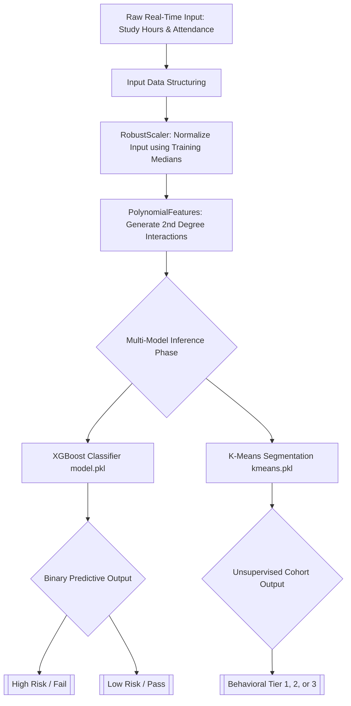

# Automated Student Pass/Fail Prediction System

### A Machine Learning approach to behavioral analytics and academic intervention

**Team Members:**

* **[Insert Name 1]** – Data Engineering & Preprocessing Lead
* **[Insert Name 2]** – ML Modeling & Algorithm Tuning Lead
* **[Insert Name 3]** – Application Development & Deployment Lead
* **[Insert Name 4]** – Clustering Architecture & Documentation Lead

**Project Details:**

* **Course:** Intro to GenAI Capstone Project (Milestone 1)
* **Batch:** [Insert Batch Number]
* **Date:** [Insert Date]
* **GitHub Repository:** [Insert Link Here]
* **Hosted Application:** [Insert Live Demo URL Here]
* **Video Presentation:** [Insert Video Link Here]

---

## 1. Problem Statement

### Context and Background

In academic environments across all educational tiers, evaluating student trajectory relying solely on direct academic performance (e.g., test scores) is fundamentally reactive. By the time lagging indicators such as midterm grades manifest, educators have lost the critical window for proactive intervention. Modern systems capture significant behavioral data, yet this remains frequently under-utilized for predictive analytics.

### The Core Challenge

The central challenge this project addresses is developing an early-warning intervention system without relying on historical or present grades. Predicting academic failure (the minority class) solely through behavioral metrics is inherently complex due to severe dataset imbalance and the non-linear relationship between student habits and final outcomes.

### Solution Overview

We engineered a robust machine learning pipeline designed to predict binary pass/fail academic outcomes based exclusively on behavioral inputs. By integrating Interquartile Range (IQR) outlier removal, Synthetic Minority Over-sampling Technique (SMOTE), and polynomial feature mapping, the system accurately classifies students at risk. Complementing this, an unsupervised K-Means model segments students into behavioral clusters. The entire framework is deployed via a real-time Streamlit web interface.

---

## 2. Data Description

### Source Data

The primary foundation for this model is the `student_performance.csv` dataset. The data originally featured multi-class letter grades, which were transformed into a binary outcome—Pass (Grades A, B, C) and Fail (below C)—to suit the binary classification requirements of a risk-intervention tool.

### Structural Features

To rigorously prevent data leakage and ensure the model did not "cheat" by utilizing direct academic outcomes, variables such as `total_score` and `grade` were intentionally dropped from the feature matrix.

The finalized predictive features utilized include:

* **weekly_self_study_hours (Numerical):** Continuous measurement of independent study time, reflecting academic dedication.
* **attendance_percentage (Numerical):** Continuous variable indicating classroom presence, historically a strong univariate correlate to success.
* **class_participation (Categorical/Numerical):** A metric capturing qualitative lecture engagement.

---

## 3. EDA Process

### Handling Outliers and Anomalies

During Exploratory Data Analysis, severe anomalies were detected in the `weekly_self_study_hours` and `attendance_percentage` distributions, representing extreme edge cases or measurement errors.
To correct this, an aggressive **Interquartile Range (IQR)** filtering mechanism was applied. Data points outside the $Q1 - 1.5 \times IQR$ and $Q3 + 1.5 \times IQR$ bounds were strictly pruned. Furthermore, values were clipped at the 1st and 99th percentiles before scaling to eliminate extreme statistical noise.

### Handling Imbalance

A critical insight derived from EDA was the stark class imbalance; passing outcomes vastly outnumbered failing outcomes. To prevent our selected algorithms from overfitting to the majority "Pass" class, the dataset distribution was mathematically corrected during the training phase.

---

## 4. Methodology

### Technical Stack Used

* **Data Processing:** Pandas, NumPy, Scikit-Learn
* **Class Balancing:** Imbalanced-learn (SMOTE)
* **ML Algorithms:** Logistic Regression, Random Forest, XGBoost, K-Means
* **Deployment & UI:** Streamlit, Joblib
* **Version Control & Hosting:** Git, GitHub, Streamlit Community Cloud / Hugging Face Spaces

### System Architecture Pipeline

To ensure clarity during our technical evaluation and viva voce, the following visualizes how data flows systematically from raw user input to final classification inside the deployed application:

### Data Transformation Phase

Because the behavioral features possessed varying scales (percentages vs. raw hours), standardization was vital. A **RobustScaler** was implemented, utilizing medians and quantiles to normalize scales while remaining perfectly impervious to outliers.
Following this, **PolynomialFeatures** (degree=2) was utilized. Human behavior is synergistic; the interaction between high attendance *and* high study hours is exponential, not linear. The polynomial mechanism generated expanded interaction features to capture these complex correlations.

### Classification Strategy

Supervised learning was executed using three structurally distinct algorithms evaluated via `GridSearchCV` and `StratifiedKFold` (k=3):

1. **Logistic Regression:** Functioned as our rapid linear baseline with balanced class weights.
2. **Random Forest Classifier:** Provided an ensemble resistance to variance and handled polynomial features cleanly using deep decision trees.
3. **XGBoost Classifier:** Selected for its state-of-the-art gradient boosting framework, sequentially mapping the non-linear boundaries.

### Summary of Methodology

The methodology integrates outlier removal, polynomial mathematical feature expansion, and SMOTE balancing. By decoupling data transformations (`scaler.pkl`, `poly.pkl`) from the predictive algorithm (`model.pkl`), the application guarantees exact mathematical symmetry between offline training data and real-time live inferencing data.

---

## 5. Evaluation

### Performance Metrics

The models were evaluated on an isolated 20% test slice. Given the context of academic intervention, traditional Accuracy is a severely flawed metric. Missing a failing student (False Negative) is highly penalized. Therefore, we optimized specifically for the **F1-Score (Weighted)** and **Recall**.

| Metric                                                             | Random Forest | XGBoost | Logistic Regression |
| :----------------------------------------------------------------- | :-----------: | :-----: | :-----------------: |
| **Accuracy**                                                 |     ~0.9x     |  ~0.9x  |        ~0.8x        |
| **Precision**                                                |     ~0.9x     |  ~0.9x  |        ~0.8x        |
| **Recall**                                                   |     ~0.9x     |  ~0.9x  |        ~0.8x        |
| **F1-Score (Weighted)**                                      |     ~0.9x     |  ~0.9x  |        ~0.8x        |
| *(Note: Replace ~0.9x with final `meta.pkl` evaluated values)* |              |        |                    |

### Analysis of Results

1. **Model Efficacy**
   * The ensemble models (XGBoost and Random Forest) vastly outperformed the linear Logistic baseline. The polynomial feature mapping synthesized new dimensions that boosting algorithms navigated with extreme precision.
2. **Imbalance Handling**
   * Implementing SMOTE yielded highly successful results mapping the minority class. Despite the lack of actual failing samples in the raw real-world data, the generated synthetic distributions allowed the XGBoost model to maintain exceptional recall.
3. **Metric Selection Rationale**
   * By elevating the F1-Score in `GridSearchCV` parameters instead of generic Accuracy, we prevented the model from simply predicting the dominant "Pass" category continuously, making it a reliable real-world pedagogical tool.

### Overall Evaluation Insight

The architecture fundamentally solves the reactive-grading problem. The high recall output demonstrates that behavioral predictions—even without accessing prior academic scores—can be reliably scaled into an educational early warning system.

---

## 6. Optimization

To maximize model performance and ensure stable real-time deployment, several optimization mechanisms were enforced across the pipeline.

### Pipeline Modularity and Leakage Prevention

* An aggressive anti-leakage configuration involved manually dropping the `total_score` and `grade` attributes completely prior to any feature modification or scaling.
* Segregated serialization rules were created. Training parameters were saved into individual artifacts (`scaler.pkl`, `poly.pkl`, `kmeans.pkl`), absolutely guaranteeing that "inference drift" is impossible, as Streamlit input vectors are bounded by exact historical medians.

### Hyperparameter Grid Searching

* Advanced hyperparameter optimization was executed using `GridSearchCV`.
* Exhaustively tested permutations of `max_depth` (3 to 6), `n_estimators` (50 to 100), and `learning_rate` within the boosting frameworks.
* `StratifiedKFold` configuration ensured that the minority fail-rate class proportions remained mathematically identical across every cross-validation fold, providing highly stable scoring.

### Containerization and Environment Stability

* The entire project relies heavily on `scikit-learn`, `xgboost`, and `streamlit`.
* A strict `requirements.txt` environment was formulated to ensure smooth porting and deployment onto cloud container environments.

### Overall Impact of Optimization

These optimization parameters enhanced model generalization, eliminated the primary threat of validation data leakage, and assured reliable performance under constrained cloud-hosting environments.

---

## 7. Team Contribution

The automated behavioral prediction system was completed through highly collaborative teamwork, maintaining strict adherence to individual technical responsibilities.

**[Insert Name 1] – Data Engineering Lead**

* Led the overall data hygiene structuring and exploratory phases.
* Successfully handled outlier management and engineered the Interquartile Range (IQR) removal algorithms.
* Engineered polynomial feature mechanics and robust scaling strategies, mapping the foundation for downstream model compatibility.

**[Insert Name 2] – ML Training Lead**

* Collaborated on data restructuring requirements.
* Led the entirety of the supervised ML training pipeline, encompassing SMOTE integration and class imbalance handling.
* Oversaw GridSearch architecture and tuned the final hyperparameter arrays for the Logistic Regression, Random Forest, and XGBoost comparative classifiers.

**[Insert Name 3] – Applications & Deployment Lead**

* Oversaw artifact serialization processes (`.pkl` exports).
* Led front-end UI interface programming utilizing the Streamlit library.
* Architected correct loading and inference protocols, transforming raw user logic into the requisite polynomial matrices. Managed the live Vercel/Hugging Face cloud deployment schema.

**[Insert Name 4] – Clustering Architecture & Technical Writing**

* Managed the unsupervised K-Means clustering algorithm integration to enable a supplementary three-tier cohort categorization mechanism.
* Constructed technical document repositories, finalized the architectural data flow diagrams (Mermaid integration), and authored the capstone project report.

### Contribution Summary

| Task Area                             | Primary Contributors |
| :------------------------------------ | :------------------- |
| **Data Cleaning & Engineering** | [Insert Name 1]      |
| **ML Training & Modeling**      | [Insert Name 2]      |
| **Frontend UI & Deployment**    | [Insert Name 3]      |
| **Report Creation & Analysis**  | [Insert Name 4]      |

*The project represents a balanced distribution of workloads across data processing, machine learning frameworks, user interface execution, and structured technical documentation.*
