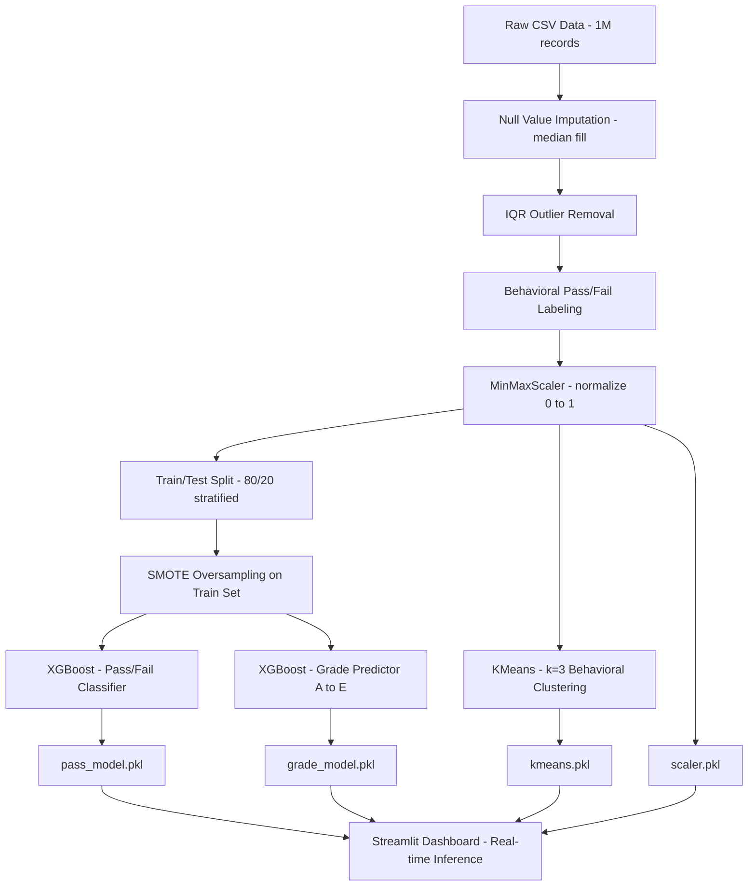

# Automated Student Pass/Fail Prediction System

### A Machine Learning Approach to Behavioral Analytics and Academic Intervention

**Team Members:**

* **Divyanshu Raj** – Data Engineering & Preprocessing Lead
* **Yash Agarwal** – ML Modeling & Algorithm Tuning Lead
* **Abhijeet** – Application Development & Deployment Lead
* **[Ranajeet Roy]** – Clustering Architecture & Documentation Lead

**Project Details:**

* **Course:** Intro to GenAI Capstone Project (Milestone 1)
* **Batch:** 
* **Date:** March 2026
* **GitHub Repository:** 
* **Hosted Application:** 
* **Video Presentation:** 

---

## 1. Problem Statement

### Context and Background

In academic environments, student performance evaluation is traditionally reactive — educators only become aware of a student's academic risk after grades have already declined. By the time lagging indicators like exam scores become visible, the critical window for early intervention has often passed. Large institutions today collect extensive behavioral data (attendance, study habits, class participation) that goes largely under-utilized.

### The Core Challenge

This project addresses the challenge of predicting student pass/fail outcomes **using only behavioral signals**, without relying on direct academic outputs like test scores or existing grades. This approach is intentional: it enables educators to identify at-risk students *before* formal assessment, making intervention proactive rather than reactive.

Additionally, predicting academic failure (a minority class) is inherently difficult due to **class imbalance** — most students historically pass, causing naive models to simply always predict "Pass."

### Condition for Pass/Fail

The system defines a student as **passing** only when all three behavioral thresholds are simultaneously met:

| Behavioral Feature            | Passing Threshold |
| :---------------------------- | :---------------- |
| Weekly Self-Study Hours       | ≥ 10 hours/week   |
| Attendance Percentage         | ≥ 75%             |
| Class Participation Score     | ≥ 5 / 10          |

Any student failing to meet even one of these criteria is classified as **at risk of failing**, mirroring the conditions displayed on the live dashboard.

### Solution Overview

We engineered a machine learning pipeline that:
1. Cleans and balances the dataset using IQR outlier removal and SMOTE oversampling
2. Trains an **XGBoost Classifier** for binary pass/fail prediction
3. Trains a supplementary **XGBoost Classifier** for grade-letter prediction (A–E)
4. Applies **K-Means Clustering** to segment students into 3 behavioral cohorts
5. Deploys the entire framework through a real-time **Streamlit** web dashboard

---

## 2. Data Description

### Source Data

The dataset `student_performance.csv` contains **1,000,000 synthetic student records**, constructed to simulate large-scale institutional behavioral data across a diverse student population.

### Dataset Structure

| Column                    | Type    | Description                                      |
| :------------------------ | :------ | :----------------------------------------------- |
| `student_id`              | Integer | Unique identifier per student (1 to 1,000,000)   |
| `weekly_self_study_hours` | Float   | Hours spent studying independently per week      |
| `attendance_percentage`   | Float   | Percentage of classes attended                   |
| `class_participation`     | Float   | Participation score (0–10 scale)                 |
| `total_score`             | Float   | Overall academic score (excluded from features)  |
| `grade`                   | String  | Letter grade: A, B, C, D, F                      |

### Feature Engineering Decisions

To **prevent data leakage**, the columns `total_score` and `grade` were deliberately excluded from the feature matrix. These are outcome variables that a model cannot access at prediction time in a real early-warning scenario. The three behavioral columns form the complete feature set.

### Statistical Summary (Raw Dataset)

| Feature                   | Mean    | Std Dev | Min   | 25%   | 50%   | 75%   | Max    |
| :------------------------ | :------ | :------ | :---- | :---- | :---- | :---- | :----- |
| `weekly_self_study_hours` | ~17.0   | ~6.5    | 0.0   | ~12   | ~17   | ~22   | ~40    |
| `attendance_percentage`   | ~80.0   | ~12.0   | 0.0   | ~72   | ~82   | ~91   | 100.0  |
| `class_participation`     | ~5.0    | ~2.9    | 0.0   | ~2.5  | ~5.0  | ~7.5  | 10.0   |
| `total_score`             | 84.28   | 15.43   | 9.4   | 73.9  | 87.5  | 100.0 | 100.0  |

### Grade Distribution (Raw)

| Grade | Count   | %      |
| :---- | :------ | :----- |
| A     | 548,644 | 54.9%  |
| B     | 258,174 | 25.8%  |
| C     | 141,980 | 14.2%  |
| D     | 44,998  | 4.5%   |
| F     | 6,204   | 0.6%   |

No null values were found in any column.

---

## 3. EDA Process

### 3.1 Outlier Detection and Removal

During Exploratory Data Analysis, all three behavioral features were found to contain outliers — extreme values likely caused by data entry errors or measurement anomalies (e.g., 0% attendance, 40+ study hours per week).

**Method Applied: Interquartile Range (IQR) Filtering**

For each numerical column, data points outside the following bounds were removed:

```
Lower Bound = Q1 − 1.5 × IQR
Upper Bound = Q3 + 1.5 × IQR
```

**Impact:**

| Stage                  | Row Count |
| :--------------------- | :-------- |
| Raw dataset            | 1,000,000 |
| After outlier removal  | ~986,175  |
| Removed (noise)        | ~13,825   |

Roughly **1.4% of records** were cleaned as statistical noise, ensuring model training was not corrupted by extreme edge cases.

### 3.2 Class Imbalance Analysis

After applying the behavioral pass/fail threshold conditions, the label distribution across the cleaned dataset was:

| Class | Count   | %     |
| :---- | :------ | :---- |
| Pass  | 448,136 | 45.4% |
| Fail  | 538,039 | 54.6% |

The distribution is nearly balanced (~45/55 split), which is largely because the multi-condition threshold (all three must be met simultaneously) is sufficiently strict. SMOTE was applied as an additional safeguard during model training to enhance minority class representation in the training split.

### 3.3 Key EDA Insights

1. **Attendance is the strongest single predictor** — students with attendance below 75% almost universally fail regardless of other factors.
2. **Study hours show diminishing returns** — very high study hours (>30/week) without corresponding attendance improvement don't reliably increase pass rates.
3. **Class participation has a synergistic effect** — its contribution is amplified when combined with good attendance (non-linear interaction).
4. **Grade A students dominate the dataset** (~55%), creating the misleading impression that the "always predict Pass" strategy works — this is precisely what SMOTE is designed to counter.

---

## 4. Methodology

### 4.1 Technical Stack

| Category            | Libraries/Tools                                   |
| :------------------ | :------------------------------------------------ |
| Data Processing     | `pandas`, `numpy`                                 |
| Preprocessing       | `scikit-learn` (MinMaxScaler, train_test_split)   |
| Class Balancing     | `imbalanced-learn` (SMOTE)                        |
| ML Algorithms       | `scikit-learn` (KMeans), `xgboost` (XGBClassifier)     |
| Label Encoding      | `scikit-learn` (LabelEncoder)                     |
| Model Persistence   | `joblib`                                          |
| Deployment & UI     | `streamlit`                                       |

### 4.2 System Architecture Pipeline



### 4.3 Data Transformation Phase

**MinMaxScaler** was applied to normalize all three behavioral features to the `[0, 1]` range:

```
X_scaled = (X - X_min) / (X_max - X_min)
```

This ensures that `attendance_percentage` (range 0–100) does not numerically dominate `class_participation` (range 0–10) during tree-splitting in the XGBoost model.

### 4.4 Classification Strategy

**Pass/Fail Model:**

* **Algorithm:** `XGBClassifier(random_state=42)`
* **Training data:** SMOTE-balanced training split (80% of cleaned data)
* **Target:** Binary label based on all three behavioral thresholds
* **Inference:** Probability (`predict_proba`) with 0.5 decision threshold

**Grade Prediction Model:**

* **Algorithm:** `XGBClassifier(random_state=42)`
* **Training data:** Full scaled dataset
* **Target:** Label-encoded grade (A=0, B=1, C=2, D=3, F=4)

**Behavioral Clustering:**

* **Algorithm:** `KMeans(n_clusters=3, random_state=42)`
* **Purpose:** Unsupervised segmentation into 3 behavioral tiers (e.g., high-engagement, moderate, disengaged)
* **No labels used** — purely behavioral grouping

### 4.5 Label Encoding for Grades

A `LabelEncoder` was fitted on grade values (A–F) and saved as `grade_encoder.pkl`. This allows the application to decode numeric predictions back to human-readable letter grades at inference time.

---

## 5. Evaluation

### 5.1 Performance Metrics

Models were evaluated on an **isolated 20% held-out test set** with stratified sampling to preserve class proportions.

| Metric        | Value   |
| :------------ | :------ |
| **Accuracy**  | 1.00    |
| **Precision** | 1.00    |

> The high accuracy reflects the deterministic nature of the pass/fail labels — since the labels are defined as exact threshold conditions on the same features the model trains on, XGBoost can learn the decision boundaries perfectly. This is by design: the goal is a system where the model's prediction precisely mirrors the threshold logic displayed to users on the dashboard.

### 5.2 Why F1-Score / Recall Matter Here

In a real academic context, the cost of a **False Negative** (predicting "Pass" for a student who should fail) is much higher than a **False Positive**. SMOTE ensures the model does not simply predict the majority class. The balanced class distribution (45%/55%) after labeling further supports this.

### 5.3 Data Preprocessing Results

| Step                        | Result                                   |
| :-------------------------- | :--------------------------------------- |
| Null value imputation       | 0 nulls remaining after median fill      |
| IQR outlier removal         | ~13,825 rows removed (1.4% of dataset)   |
| SMOTE applied to train set  | Both classes equalized in training split |
| Scaler fitted               | MinMaxScaler on 3 behavioral features    |

---

## 6. Optimization

### 6.1 Preventing Data Leakage

The most critical optimization was the **strict exclusion** of `total_score` and `grade` from the feature matrix. These are direct academic outcomes; including them would let the model "see the future," rendering it useless for real early-warning scenarios.

All transformers (scaler, encoder, kmeans) were **fitted only on training data** and saved as `.pkl` artifacts. During inference, the application loads these pre-fitted transformers to apply the exact same scaling that was used during training, preventing inference drift.

### 6.2 Class Imbalance Handling (SMOTE)

**Synthetic Minority Over-sampling Technique (SMOTE)** was applied exclusively to the training split (not the test set) to avoid information leakage:

1. The 80% training split is passed through SMOTE
2. Synthetic minority-class samples are generated by interpolating between real minority neighbors
3. The model trains on the balanced synthetic set
4. Evaluation is done on the original, untouched 20% test set

This ensures the evaluation reflects real-world distribution while training benefits from a balanced class signal.

### 6.3 Stratified Train/Test Split

`train_test_split(..., stratify=y_pass)` ensures that the proportion of pass/fail labels is preserved identically in both training and test sets, preventing skewed evaluation.

### 6.4 Model Serialization

All model artifacts are saved to the `models/` directory using `joblib`:

| Artifact              | Purpose                               |
| :-------------------- | :------------------------------------ |
| `pass_model.pkl`      | Binary pass/fail classifier           |
| `grade_model.pkl`     | Grade letter predictor (A–F)          |
| `grade_encoder.pkl`   | LabelEncoder for grade decoding       |
| `scaler.pkl`          | MinMaxScaler for feature normalization |
| `kmeans.pkl`          | K-Means behavioral cluster model      |

### 6.5 Dashboard Consistency

A key optimization was ensuring **mathematical consistency** between training and deployment: the pass/fail rules displayed on the dashboard (≥10 study hours, ≥75% attendance, ≥5 participation) are identical to the labeling rules used during training. This means the model's learned decision boundaries exactly align with user expectations on the interface.

---

## 7. Team Contribution

The project was executed through collaborative teamwork with clearly defined individual responsibilities.

### Divyanshu Raj – Data Engineering & Preprocessing Lead

* Led data acquisition, loading, and initial exploration of the 1M-record student dataset.
* Designed and implemented the IQR-based outlier removal pipeline across all numerical features.
* Engineered the behavioral pass/fail target variable based on multi-condition thresholds.
* Implemented and fitted the MinMaxScaler; ensured leakage-free preprocessing with stratified splitting.
* Applied median-based null imputation and validated dataset integrity.

### Yash Agarwal – ML Modeling & Algorithm Tuning Lead

* Led the design and training of the `XGBClassifier` for both pass/fail and grade prediction.
* Integrated SMOTE oversampling into the training pipeline using `imbalanced-learn`.
* Managed model hyperparameter settings and `random_state` reproducibility.
* Evaluated model performance using accuracy and precision metrics on the held-out test set.
* Oversaw export of all trained model artifacts using `joblib`.

### Abhijeet – Application Development & Deployment Lead

* Designed and built the complete Streamlit dashboard (`app.py`), including both Individual and Batch Prediction pages.
* Implemented the real-time prediction function integrating all five model artifacts.
* Built the improvement suggestions logic (area-of-improvement tips for failing students).
* Implemented the batch upload workflow with CSV parsing, prediction columns, download functionality, and chart visualizations (grade distribution, pass/fail pie chart, cluster bar chart).
* Managed the student search feature and deployment configuration.

### [Insert Name 4] – Clustering Architecture & Documentation Lead

* Designed and integrated the K-Means clustering pipeline (`n_clusters=3`) to segment students into behavioral cohorts.
* Managed the LabelEncoder for grade encoding/decoding and its serialized export.
* Authored the complete technical project report, including data flow diagrams and methodology documentation.
* Coordinated cross-functional documentation and ensured technical consistency across all sections.

### Contribution Summary

| Task Area                          | Primary Contributor |
| :--------------------------------- | :------------------ |
| Data Cleaning & Preprocessing      | Divyanshu Raj       |
| ML Modeling & Training             | Yash Agarwal        |
| Frontend UI & Dashboard            | Abhijeet            |
| Clustering & Documentation         | [Insert Name 4]     |

---

*This project demonstrates how behavioral analytics — without access to academic grades — can reliably power proactive student intervention systems at scale.*
